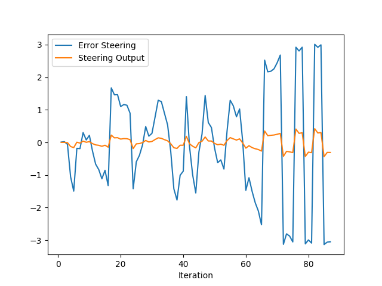
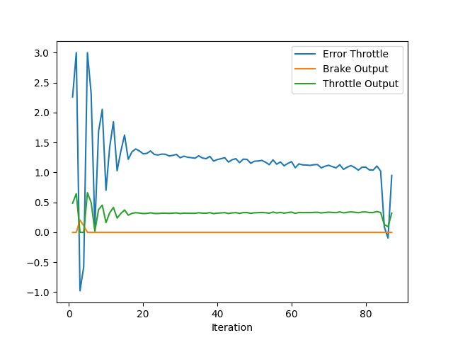

Answer the following questions:

Add the plots to your report and explain them (describe what you see)

Figure 1: steer error

As seen in Figure 1(steer error), the steer output correlates (directionally) with the steering error. Using a relatively low value for Kp (0.1) means that the vehicle will avoid making sharp turns and then having to oscillate very often. There also doesn't seem to be a systematic bias as there is no "steady" level of error in the graph. Also, using a low value for Kp means that it will need to travel longer (distance) to get to the desired position.

Figure 2: throttle error

As seen in Figure 2 (throttle error & output), the error doesn't make big oscillations after the first few iterations. The vehicle is able to navigate at a steady (although slow) speed through all the obstacles (and the 3 other vehicles) without collisions successfully. 

What is the effect of the PID according to the plots, how each part of the PID affects the control command?

PID Control is made of 3 parameters:
- Kp (Proportional). This looks at the raw error (CTE/Cross Track Error) and computes a control signal proportional to this error. Higher values means it'll respond faster, however will cause oscillations
- Ki (Integral). This is used to address systematic bias in the system, such as wheel misalignments in a vehicle. Without this parameter, systematic biases cannot be addressed by Kp and Kd alone
- Kd (Differential). This looks at the rate of change of the Tracking error, so that this can be used to dampen the oscillations, and generate a smoother control signal, which is desirable in many scenarios including autonomous driving.

How would you design a way to automatically tune the PID parameters?

We can use an algorithm such as Twiddle, and attempt to optimize the parameters iteratively.

PID controller is a model free controller, i.e. it does not use a model of the car. Could you explain the pros and cons of this type of controller?

PID controller can be applied to a wide variety of systems control aplications. They are relatively easy to implement, and can be effective for any real-time monitoring of systems.  This is a good solution when the underlying process is difficult to model.

The cons are that the effectiveness of the PID controller depends on the parameter values, which can be challenging to get right across a variety of conditions.

(Optional) What would you do to improve the PID controller?

- Use an algorithm such as Twiddle to improve the parameter initializations.